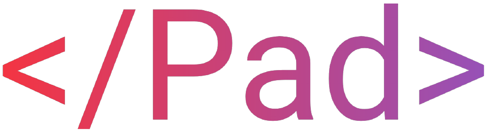

<p align="center"><a href="https://pad.blueskyfr.space" target="_blank"></a></p>

:watermelon: The source code behind [pad.blueskyfr.space](https://pad.blueskyfr.space)!

This repository contains the front-end code, written with Vue.js, and the server code in the `server/` directory, running on Node.js.

## Requirements

- MongoDB
- Yarn _(Classic)_ (I like it and v2 is bad)
- Maybe I forget something idk

## Installation instructions (dev)

Clone the repo:

```bash
gh repo clone BlueskyFR/pad
# or
git clone git@github.com:BlueskyFR/pad.git
```

Then install the dependencies and create a black hole in your computer:

```bash
yarn
# The black hole's name is now "node_modules"
```

## Dev docs

_Aka documentation for developpers_

Here are some descriptions for some files:

|               Filename               | Purpose                                                           |
| :----------------------------------: | ----------------------------------------------------------------- |
|        `copy-socket.io.js.sh`        | Extracts Socket.io.js from the node_modules folder into `public/` |
| `server/generateGoogleAuthSecret.js` | Generates a new Google Auth A2F token (cf. FAQ)                   |

## FAQ

- Why is there a Google Authenticator token? _It allows the admin to access any pad without password._
- What is the .json5 extension? _JSON5 is an extension of JSON, adding support for all the good stuff in ECMAScript 5_

## Contribute

**PLEASE** OMG feel free to open issues this would help me a lot but **PLEASE** make sure to include **steps to reproduce the bugs**.

You can also open issues to submit your ideas this would be awesome too.

## Todo

- Migrate to Typescript
- Upgrade dependencies + upgrade to Vue.js 3 when possible (full toolchain stable release not available yet)
- Create PM2 ecosystem file
- Display the number of online people **per pad** and for the entire site on the main page
- Markdown live preview
- Some fixes ya know some things are a liiiittle broken sometimes (this is intentionnal btw :smirk:)
- Create a CSRF-like token to avoid letting a client start infinite connections per page?
- Limit pads names lengths
- Limit pads content lengths
- Fix bugs with "special" chars in url
- Fix disconnection/desync problems -> needs repro steps
- Create admin management page (pads deletion, etc.)
- Add Github repo banner
- Add download button on pads
- Send text diff instead of whole text each time -> A/B mirrors system -> check if deltas can be applied on server side
- Pad history (restore previous versions, maybe limit the number of saves to 6, with 1 backup every 5 min, only if pad is NOT unloaded)
